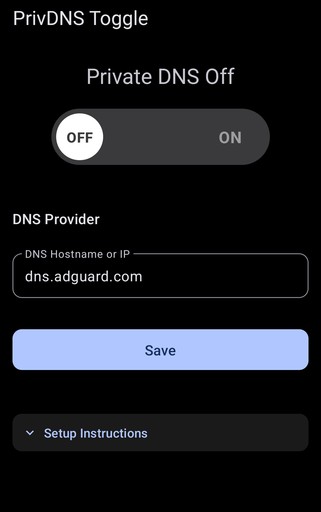
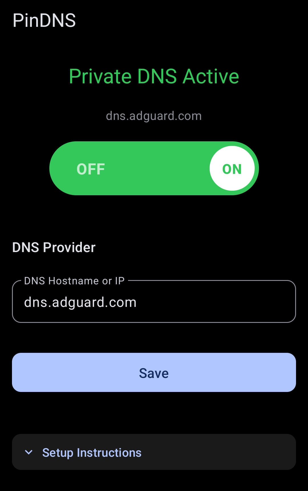
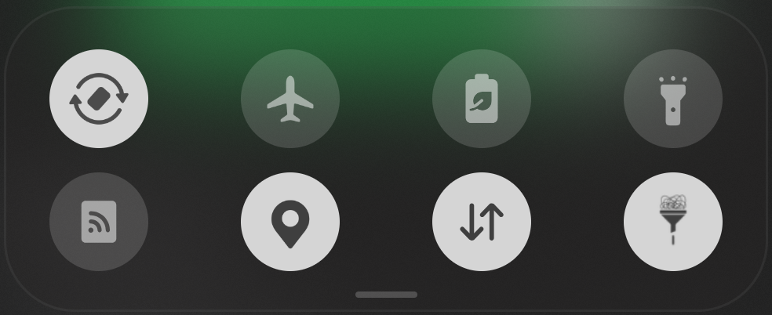

<div align="center">


<h1>PinDNS</h1>
<br/>

[](https://github.com/mjryan253/PinDNS/releases/latest)
[](https://github.com/mjryan253/PinDNS/releases)
[](LICENSE)
[](https://github.com/mjryan253/PinDNS/actions/workflows/ci.yml)
[](https://github.com/mjryan253/PinDNS/actions/workflows/dependency-check.yml)
[](#requirements)

</div>

## Intro

PinDNS is a minimal Android app that turns Private DNS on and off from the Quick Settings shade or
from the app itself. It writes Android's own Private DNS setting directly: no root, no background services,
no analytics.

## Screenshots

| Private DNS off | Private DNS on |
|:---:|:---:|
|  |  |



The Quick Settings tile, bottom right, shown active. One tap toggles it.

## Download

> [!NOTE]
> PinDNS requires Android 9 or newer and a one-time permission grant via ADB or Shizuku.
> See [Requirements](#requirements) and [Setup](#setup).

[](https://github.com/mjryan253/PinDNS/releases/latest)
[](https://apps.obtainium.imranr.dev/redirect?r=obtainium://app/%7B%22id%22%3A%22com.privdnstoggle.app%22%2C%22url%22%3A%22https%3A%2F%2Fgithub.com%2Fmjryan253%2FPinDNS%22%2C%22author%22%3A%22mjryan253%22%2C%22name%22%3A%22PinDNS%22%7D)

### Verifying the APK

Release APKs are signed with the project's release key. Its certificate SHA-256 fingerprint is:

```
5344da60b330aca1109d26bac272f437d72c9a1a456aa1c9b7ea9c587ce19289
```

Check a downloaded APK with `apksigner verify --print-certs PinDNS-vX.Y.apk` (from the Android SDK
build-tools) and compare the digest. Versions up to 0.4.1 were signed with a different key: uninstall them
before installing 0.5 or later, then grant the permission again.

## Setup

### Grant the Permission (one time)

PinDNS writes Android's Private DNS system setting, which requires the `WRITE_SECURE_SETTINGS`
permission. Android does not offer this through a normal permission dialog; it must be granted via ADB or
via Shizuku.

1. Enable **USB Debugging** on your phone (Settings > Developer Options)
2. Connect your phone to your computer via USB
3. Run:

```
adb shell pm grant com.privdnstoggle.app android.permission.WRITE_SECURE_SETTINGS
```

The permission **persists across app updates**; you only need to do this once. Uninstalling the app revokes
it automatically.

> **Don't have ADB?** [Minimal ADB and Fastboot](https://minimaladbandfastboot.com/) is a small Windows
> installer with just enough to connect your phone and run the command above. The full ADB suite also ships
> with [Android Studio](https://developer.android.com/studio) under the SDK's `platform-tools`.

### No Computer? Use Shizuku

If [Shizuku](https://shizuku.rikka.app) is installed and running on the phone:

1. Open PinDNS
2. Expand **Setup Instructions**
3. Tap **Grant with Shizuku**

This runs the same grant on-device. See
[quick-start.md](quick-start.md#43-alternative-grant-via-shizuku-no-computer-needed) for the steps.

### Add the Quick Settings Tile

1. Pull down the notification shade fully
2. Tap the pencil/edit icon to edit tiles
3. Find **PinDNS Toggle** and drag it into your active tiles

## Features

| Feature | What it does |
|---------|--------------|
| **Quick Settings tile** | Tap **PinDNS Toggle** in the notification shade to toggle between your saved DNS hostname and off |
| **In-app toggle** | A large switch at the top of the app turns Private DNS on and off and shows the current status and active hostname |
| **Any provider** | Enter a DNS hostname or IP address, for example `dns.nextdns.io` or `one.one.one.one` |
| **DNS connection test** | **Save** tests the connection (10 s timeout) before storing the hostname and enabling Private DNS with it (syntax validation temporarily disabled) |
| **Shizuku support** | Grant the required permission in-app via Shizuku, no computer needed |
| **Lightweight** | No background services, no analytics |
| **Dark UI** | OLED-black Material 3 interface by default; dynamic color on Android 12+ |

## How It Works

The app reads and writes two `Settings.Global` values:

| Key | Values |
|-----|--------|
| `private_dns_mode` | `"off"`, `"opportunistic"`, `"hostname"` |
| `private_dns_specifier` | The DNS hostname (e.g. `dns.adguard.com`) |

When toggled **on**, the mode is set to `"hostname"` with your saved specifier. When toggled **off**, the
mode is set to `"off"`.

## Requirements

| Requirement | Detail |
|-------------|--------|
| Android version | Android 9 or newer (API 28) |
| Permission | One-time `WRITE_SECURE_SETTINGS` grant via ADB or Shizuku |
| Network | Internet connection during setup, for the DNS connection test |
| Devices | Officially supported on the Samsung Galaxy line (our test hardware); other devices have worked well but are not officially supported |

## Building from Source

The easiest way is to open the project in [Android Studio](https://developer.android.com/studio), let Gradle
sync, and press **Run** with a device connected. [quick-start.md](quick-start.md) walks through it step by
step.

### Command Line

| Tool | Version |
|------|---------|
| JDK | Any recent JDK to launch Gradle. The build pins its daemon to JDK 21 and downloads it automatically (`gradle/gradle-daemon-jvm.properties`); the code targets Java 17. |
| Android SDK | Platform 34, with `ANDROID_HOME` set or `sdk.dir` in `local.properties`. Android Studio sets this up for you. |
| Gradle | Provided by the wrapper; no separate install |

```sh
git clone https://github.com/mjryan253/PinDNS.git
cd PinDNS
./gradlew assembleDebug
```

Output: `builds/app/outputs/apk/debug/` (this project relocates Gradle output to `builds/`).

## Documentation

| Document | Covers |
|----------|--------|
| [quick-start.md](quick-start.md) | Step-by-step build, install and setup on a physical device |
| [docs/testing.md](docs/testing.md) | Unit tests, how to run them, continuous integration |
| [docs/debugging-with-logs.md](docs/debugging-with-logs.md) | Using the built-in debug menu to diagnose issues |
| [docs/troubleshooting.md](docs/troubleshooting.md) | Common issues and solutions |
| [docs/original-plan-idea.md](docs/original-plan-idea.md) | Initial design notes |
| [agent/agent-history.md](agent/agent-history.md) | Development history |

## Contributing

Bug reports, device test reports and pull requests are welcome. Open an
[issue](https://github.com/mjryan253/PinDNS/issues) for anything larger than a small fix. Run the
unit tests before opening a pull request:

```sh
./gradlew :app:testDebugUnitTest
```

Tests cover hostname/IP validation (`DnsManagerTest.kt`), the debug logging system (`DebugLoggerTest.kt`)
and the Private DNS settings, toggle and saved hostname (`DnsManagerSettingsTest.kt`, Robolectric).
Continuous integration runs the tests, Android Lint, a release build and an OWASP dependency vulnerability
scan on every pull request; see [docs/testing.md](docs/testing.md#continuous-integration).

## Tech Stack and Open Source Libraries

| Area | Library |
|------|---------|
| Language | [Kotlin](https://kotlinlang.org) |
| UI | [Jetpack Compose](https://developer.android.com/compose), [Material 3](https://m3.material.io/) |
| Async | [Kotlin Coroutines](https://kotlinlang.org/docs/coroutines-overview.html) |
| Permission grant | [Shizuku API](https://github.com/RikkaApps/Shizuku-API) 13.1.5 |
| Tests | [JUnit 4](https://junit.org/junit4/), [Robolectric](https://robolectric.org/) |
| Security scan | [OWASP Dependency-Check](https://owasp.org/www-project-dependency-check/) |

## Acknowledgements

- [Shizuku](https://shizuku.rikka.app) by RikkaApps, for the on-device permission grant
- [Obtainium](https://github.com/ImranR98/Obtainium) by ImranR98, for the install badge and update tracking
- "Get it on GitHub" badge from [machiav3lli/oandbackupx](https://github.com/machiav3lli/oandbackupx)

## About the Project

I'm a single developer with over 20 years of IT experience, and PinDNS is a side project I'm happy to
give back to the community. Testing and feedback are appreciated: please open an
[issue](https://github.com/mjryan253/PinDNS/issues) with bug reports or suggestions. The goal is a
**v1.0 release in Q4 2026**.

## Support the Development

If PinDNS is useful to you, you can support continued work on the project with a donation via
[PayPal](https://paypal.me/mryan351).

## License

PinDNS is free software, licensed under the GNU General Public License v3.0 or later. See
[LICENSE](LICENSE) for the full text.

## Disclaimer

PinDNS changes a system setting on your own device. It does not run a DNS service, proxy or VPN,
and it does not choose a provider for you: the hostname you enter is written to Android's Private DNS
setting as-is, so pick a provider you trust. The project is not affiliated with Google, Samsung, Shizuku
or any DNS provider.

## Table of Contents

- [Intro](#intro)
- [Screenshots](#screenshots)
- [Download](#download)
  - [Verifying the APK](#verifying-the-apk)
- [Setup](#setup)
  - [Grant the Permission (one time)](#grant-the-permission-one-time)
  - [No Computer? Use Shizuku](#no-computer-use-shizuku)
  - [Add the Quick Settings Tile](#add-the-quick-settings-tile)
- [Features](#features)
- [How It Works](#how-it-works)
- [Requirements](#requirements)
- [Building from Source](#building-from-source)
  - [Command Line](#command-line)
- [Documentation](#documentation)
- [Contributing](#contributing)
- [Tech Stack and Open Source Libraries](#tech-stack-and-open-source-libraries)
- [Acknowledgements](#acknowledgements)
- [About the Project](#about-the-project)
- [Support the Development](#support-the-development)
- [License](#license)
- [Disclaimer](#disclaimer)
